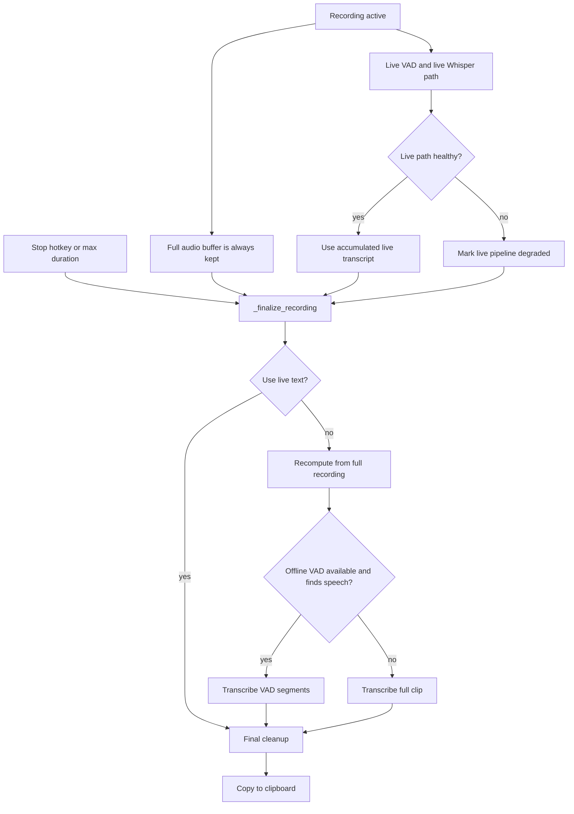
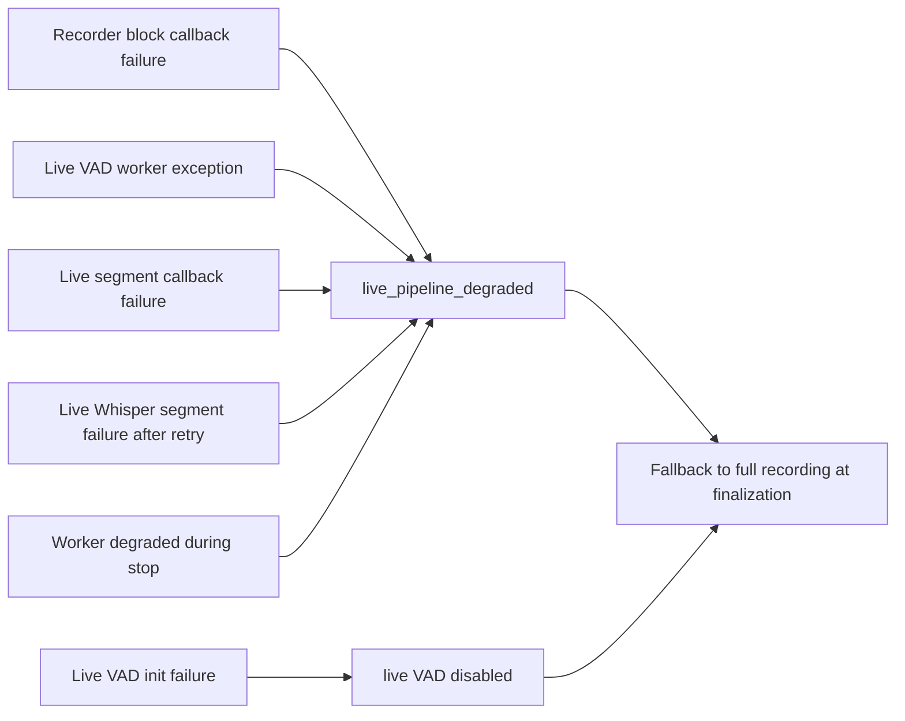
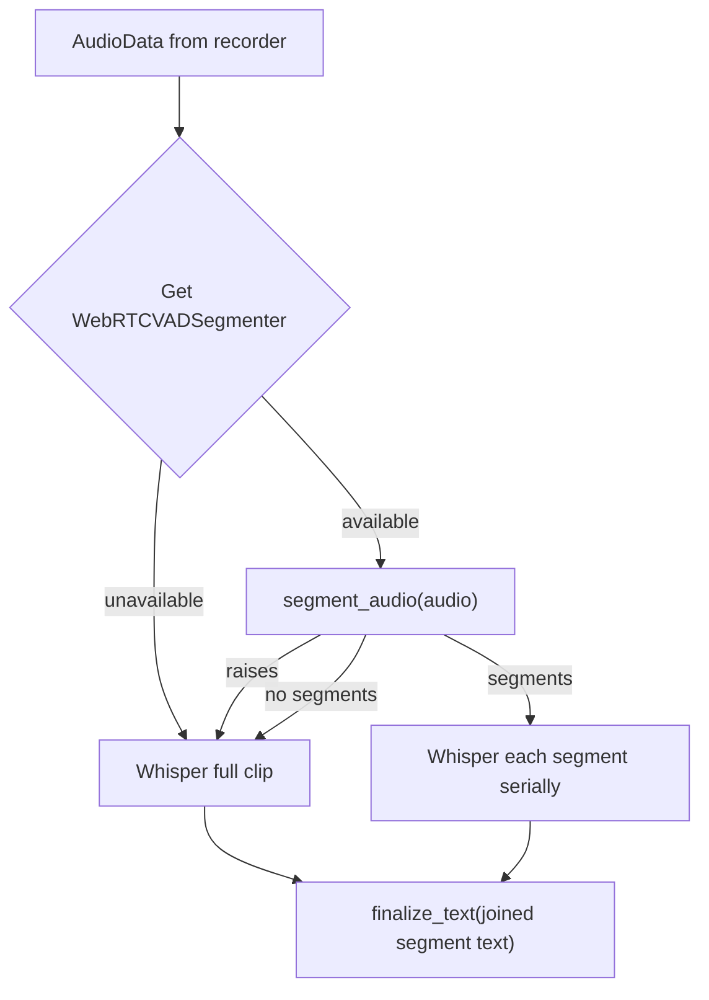
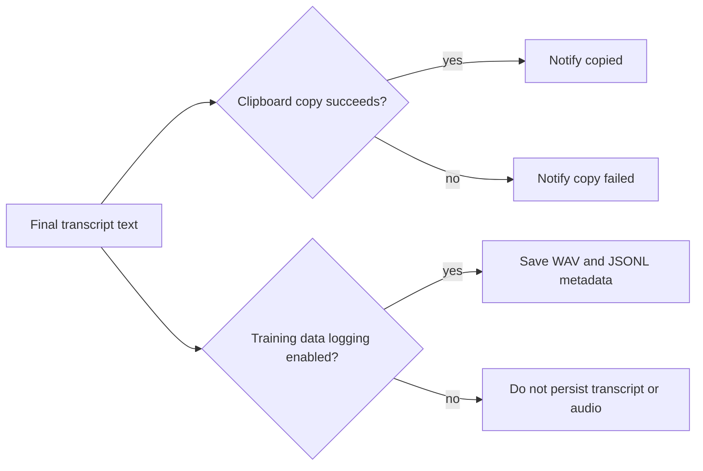

# Fallbacks And Failure Modes

Murmur treats the live pipeline as an optimization, not the only source of
truth. The full recording remains available until finalization, so most live
failures degrade to a slower full-recording path instead of losing the user's
dictation.

## Fallback Overview

## Live Degradation Sources

A degraded live path does not mean the recording failed. It means Murmur should
ignore partial live output and rebuild the final transcript from the full
recording.

## Offline Fallback Ladder

When the live transcript cannot be used, `_process_audio()` calls
`_transcribe_audio()`:

This gives Murmur three chances to produce useful text:

1. Use the live transcript accumulated during recording.
2. Recompute from offline VAD speech segments.
3. Transcribe the full clip if VAD is unavailable or unhelpful.

## Clipboard And Logging Outcomes

Finalization can still succeed even if clipboard copy fails. In that case,
Murmur reports the copy failure. If training data logging is enabled and the log
write succeeds, the transcript is still saved locally in the opt-in training
data area.

## Content Safety In Logs

Runtime logs should avoid printing dictated transcript contents. The live path
currently logs operational details such as segment IDs, durations, latency, and
text length. That preserves debuggability without exposing private dictated
text in normal console output.

## Implementation Map

| Failure or fallback | Code |
| --- | --- |
| Live pipeline degraded flag | [`src/main.py`](../src/main.py) |
| Live block callback error handling | [`src/audio.py`](../src/audio.py) and [`src/main.py`](../src/main.py) |
| Live VAD worker degradation | [`src/vad_live.py`](../src/vad_live.py) |
| Live transcription retry and degradation | [`src/transcription_live.py`](../src/transcription_live.py) |
| Full recording fallback | [`src/main.py`](../src/main.py) |
| Offline VAD fallback to full clip | [`src/main.py`](../src/main.py) |
| Clipboard result handling | [`src/main.py`](../src/main.py) and [`src/clipboard.py`](../src/clipboard.py) |
| Optional training data logging | [`src/logger.py`](../src/logger.py) |
