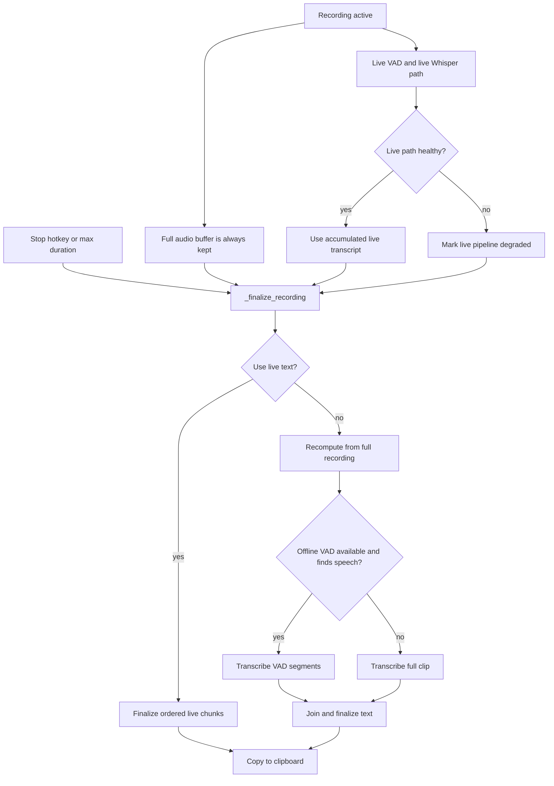
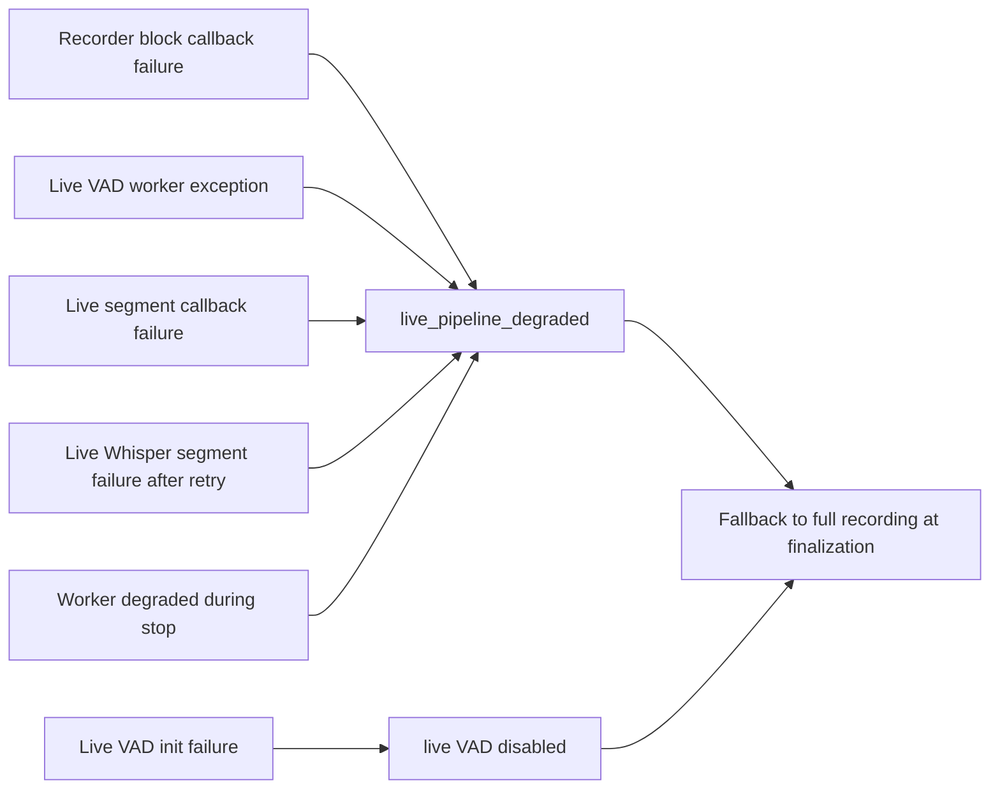
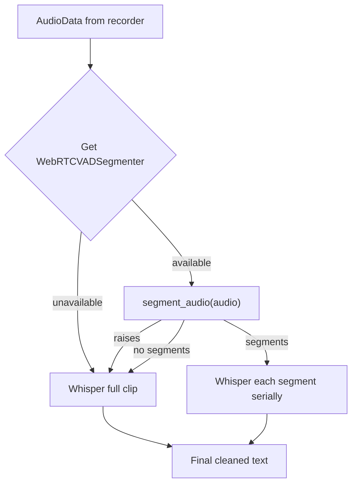
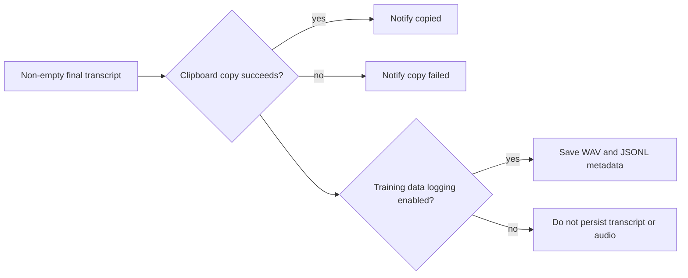

# Fallbacks And Failure Modes

Murmur treats the live pipeline as an optimization, not the only source of
truth. The full recording remains available until finalization, so most live
failures degrade to a slower full-recording path instead of losing the user's
dictation. A recording with no captured audio or a final transcription exception
is reported as a failure and does not produce clipboard output.

## Fallback Overview

```mermaid
flowchart TB
    Recording["Recording active"] --> FullBuffer["Full audio buffer is always kept"]
    Recording --> LivePath["Live VAD and live Whisper path"]

    LivePath --> LiveStatus{"Live path healthy?"}
    LiveStatus -->|yes| LiveText["Use accumulated live transcript"]
    LiveStatus -->|no| Degraded["Mark live pipeline degraded"]

    Stop["Stop hotkey or max duration"] --> Finalize["_finalize_recording"]
    FullBuffer --> Finalize
    LiveText --> Finalize
    Degraded --> Finalize

    Finalize --> Decision{"Use live text?"}
    Decision -->|yes| LiveCleanup["Finalize ordered live chunks"]
    Decision -->|no| Recompute["Recompute from full recording"]
    Recompute --> OfflineVad{"Offline VAD available and finds speech?"}
    OfflineVad -->|yes| Segments["Transcribe VAD segments"]
    OfflineVad -->|no| FullClip["Transcribe full clip"]
    Segments --> OfflineCleanup["Join and finalize text"]
    FullClip --> OfflineCleanup
    LiveCleanup --> Clipboard["Copy to clipboard"]
    OfflineCleanup --> Clipboard
```

## Live Degradation Sources

```mermaid
flowchart LR
    Callback["Recorder block callback failure"] --> Degraded["live_pipeline_degraded"]
    VadInit["Live VAD init failure"] --> Disabled["live VAD disabled"]
    VadWorker["Live VAD worker exception"] --> Degraded
    VadCallback["Live segment callback failure"] --> Degraded
    WhisperFail["Live Whisper segment failure after retry"] --> Degraded
    StopCheck["Worker degraded during stop"] --> Degraded

    Degraded --> FullFallback["Fallback to full recording at finalization"]
    Disabled --> FullFallback
```

A degraded live path does not mean the recording failed. It means Murmur should
ignore partial live output and rebuild the final transcript from the full
recording. Live VAD initialization failure is handled as a disabled optimization
and leads to the same fallback when no live text is available.

## Offline Fallback Ladder

When the live transcript cannot be used, `_process_audio()` calls
`_transcribe_audio()`:

```mermaid
flowchart TB
    AudioData["AudioData from recorder"] --> Segmenter{"Get WebRTCVADSegmenter"}
    Segmenter -->|unavailable| FullClip["Whisper full clip"]
    Segmenter -->|available| SegmentAudio["segment_audio(audio)"]
    SegmentAudio -->|raises| FullClip
    SegmentAudio -->|no segments| FullClip
    SegmentAudio -->|segments| TranscribeSegments["Whisper each segment serially"]
    TranscribeSegments --> FinalText["Final cleaned text"]
    FullClip --> FinalText
```

Both `transcribe_segments()` and `transcribe()` perform the local document
cleanup and optional Ollama pass before returning. This gives Murmur three
chances to produce useful text:

1. Use the live transcript accumulated during recording.
2. Recompute from offline VAD speech segments.
3. Transcribe the full clip if VAD is unavailable or unhelpful.

## Clipboard And Logging Outcomes

Finalization can still succeed even if clipboard copy fails. In that case,
Murmur reports the copy failure. The logger runs after the clipboard attempt, so
if training data logging is enabled and the log write succeeds, the transcript
and source audio are still saved locally in the opt-in training-data area.

```mermaid
flowchart LR
    FinalText["Non-empty final transcript"] --> Clipboard{"Clipboard copy succeeds?"}
    Clipboard -->|yes| NotifyCopied["Notify copied"]
    Clipboard -->|no| NotifyCopyFailed["Notify copy failed"]
    Clipboard --> Logging{"Training data logging enabled?"}
    Logging -->|yes| SaveLog["Save WAV and JSONL metadata"]
    Logging -->|no| SkipLog["Do not persist transcript or audio"]
```

## Content Safety In Logs

Runtime logs should avoid printing dictated transcript contents. The live path
currently logs operational details such as segment IDs, durations, latency, and
text length. That preserves debuggability without exposing private dictated
text in normal console output.

## Implementation Map

| Failure or fallback | Code |
| --- | --- |
| Live pipeline degraded flag | [`src/main.py`](https://github.com/laceyp99/murmur/blob/main/src/main.py) |
| Live block callback error handling | [`src/audio.py`](https://github.com/laceyp99/murmur/blob/main/src/audio.py) and [`src/main.py`](https://github.com/laceyp99/murmur/blob/main/src/main.py) |
| Live VAD worker degradation | [`src/vad_live.py`](https://github.com/laceyp99/murmur/blob/main/src/vad_live.py) |
| Live transcription retry and degradation | [`src/transcription_live.py`](https://github.com/laceyp99/murmur/blob/main/src/transcription_live.py) |
| Full recording fallback | [`src/main.py`](https://github.com/laceyp99/murmur/blob/main/src/main.py) |
| Offline VAD fallback to full clip | [`src/main.py`](https://github.com/laceyp99/murmur/blob/main/src/main.py) |
| Clipboard result handling | [`src/main.py`](https://github.com/laceyp99/murmur/blob/main/src/main.py) and [`src/clipboard.py`](https://github.com/laceyp99/murmur/blob/main/src/clipboard.py) |
| Optional training data logging | [`src/logger.py`](https://github.com/laceyp99/murmur/blob/main/src/logger.py) |
