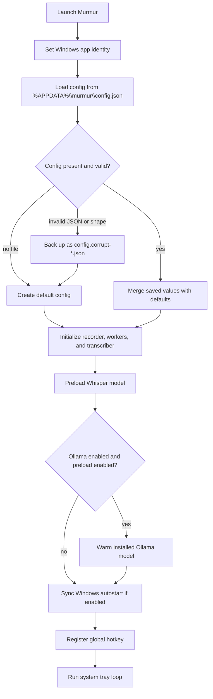

# Getting Started

Murmur is a Windows-first desktop application. It records microphone audio,
keeps the complete recording in memory, performs local Whisper transcription,
and copies the final text to the system clipboard. The live VAD and
transcription workers reduce the amount of work left after the stop hotkey, but
the full recording remains available as a fallback.

## Requirements

| Requirement | Purpose | Required? |
| --- | --- | --- |
| Windows 10 or 11 | Global hotkeys, tray integration, and Windows media/notification features | Yes |
| Python 3.12 | Supported runtime | Yes |
| Microphone | Audio capture through `sounddevice` | Yes |
| FFmpeg on `PATH` | Audio support used by Whisper | Yes |
| NVIDIA GPU and CUDA-enabled PyTorch | Faster Whisper inference | Optional; CPU fallback is supported |
| Ollama server and configured model | Final punctuation/correction pass | Optional; local cleanup remains available |

Murmur's Whisper inference is local after the model is available. Installing
Python packages and downloading a Whisper model may require internet access.
Ollama defaults to `http://localhost:11434`; configuring a remote Ollama
endpoint sends the final transcript to that endpoint.

## Install

Run these commands from a PowerShell window in the repository root:

```powershell
py -3.12 -m venv venv
venv\Scripts\python.exe -m pip install --upgrade pip
```

For an NVIDIA GPU, install the CUDA-enabled PyTorch wheel recommended by the
[official PyTorch selector](https://pytorch.org/get-started/locally/) before
installing Murmur. The repository only requires `torch`; the exact CUDA wheel
depends on the driver and Python environment.

```powershell
venv\Scripts\python.exe -m pip install torch --index-url https://download.pytorch.org/whl/cu121
```

Then install Murmur and its development tools:

```powershell
venv\Scripts\python.exe -m pip install -e ".[dev]"
```

For CPU-only use, skip the CUDA command and let the editable install resolve
the PyPI Torch dependency. Confirm a CUDA setup before launching if GPU use is
expected:

```powershell
venv\Scripts\python.exe -c "import torch; print('torch', torch.__version__); print('cuda build', torch.version.cuda); print('cuda available', torch.cuda.is_available()); print('gpu', torch.cuda.get_device_name(0) if torch.cuda.is_available() else 'n/a')"
```

Install FFmpeg separately and add the directory containing `ffmpeg.exe` to
`PATH`. Open a new terminal after changing `PATH`.

## Optional Ollama setup

Ollama is enabled by default, but it is not required for the core
record-transcribe-copy workflow. Install Ollama separately and pull the model
matching the default settings:

```powershell
ollama pull granite4.1:3b
```

Start Ollama using its desktop service or with `ollama serve`. If the service,
model, or request is unavailable, Murmur keeps the locally cleaned transcript
and continues finalization. Use **Settings > LLM Cleanup > Test Ollama
Connection** to check an endpoint and model.

## Launch

The supported launch options all call the same `src.main:main` entry point:

```powershell
# Visible console
venv\Scripts\python.exe run.py

# Background process without a console window
venv\Scripts\pythonw.exe run.py

# Installed console script
venv\Scripts\murmur.exe

# Python module form
venv\Scripts\python.exe -m src
```

`run_background.vbs` is the convenience launcher for the background mode. It
prefers `venv\Scripts\pythonw.exe` for source development, then uses
`dist\Murmur\murmur.exe` when a packaged build exists, and finally falls back
to `pythonw.exe` from `PATH`.

## Build a packaged release

The packaged release keeps the Python source workflow above unchanged while
providing a standalone Windows application folder. Build it from the repository
root with PowerShell:

```powershell
powershell -ExecutionPolicy Bypass -File .\build_windows.ps1
```

The script installs the pinned PyInstaller dependency into `venv`, generates
Windows icon and version resources, builds Murmur, and runs a packaged dependency
self-check. The first build can take several minutes because Whisper, Torch, and
their native libraries are analyzed.

The release is written to `dist\Murmur\`. Keep that directory together when
copying or distributing the application, then launch `murmur.exe`. End users do
not need a separate Python installation, but FFmpeg must still be available on
`PATH`. The first launch can download the configured Whisper model if it is not
already in the user's cache.

For repeat local builds after dependencies are installed, skip the install step:

```powershell
powershell -ExecutionPolicy Bypass -File .\build_windows.ps1 -SkipInstall
```

## First launch



The first launch downloads the selected Whisper model if it is not already in
Whisper's user cache. Ollama warmup checks for an installed model but does not
download one. If the configured hotkey is invalid or cannot be registered,
Murmur attempts to reset it to the default `ctrl+shift+space`; an unrecoverable
registration failure stops startup.

## Record a transcript

1. Wait for the Murmur icon in the Windows system tray.
2. Press `Ctrl+Shift+Space` (or the configured hotkey) to start recording.
3. Speak normally. Murmur captures 100 ms recorder blocks and processes sealed
   speech segments in background workers.
4. Press the hotkey again to stop, or let the configured maximum duration stop
   capture.
5. Wait for the final VAD flush, queued live transcription, cleanup, and
   clipboard copy.
6. Paste with `Ctrl+V` in the target application.

Silence closes VAD segments; it does not stop the overall recording. The stop
path uses the accumulated live text when healthy. If live processing is empty
or degraded, Murmur recomputes from the complete recorded audio.

## Development checks

The project uses Ruff and pytest. With the repository virtual environment:

```powershell
venv\Scripts\python.exe -m pip install -e ".[dev]"
venv\Scripts\ruff.exe format --check .
venv\Scripts\ruff.exe check .
venv\Scripts\pytest.exe
```

To preview or build this documentation site, install the MkDocs dependencies
listed in [`mkdocs.yml`](https://github.com/laceyp99/murmur/blob/main/mkdocs.yml):

```powershell
venv\Scripts\python.exe -m pip install mkdocs-material pymdown-extensions
venv\Scripts\python.exe -m mkdocs serve
```

Use `venv\Scripts\python.exe -m mkdocs build --strict` for a CI-style build.

See the [pipeline documentation](pipeline.md) for implementation details and
the [settings and privacy guide](settings-and-privacy.md) for persistent data
and configuration behavior.
