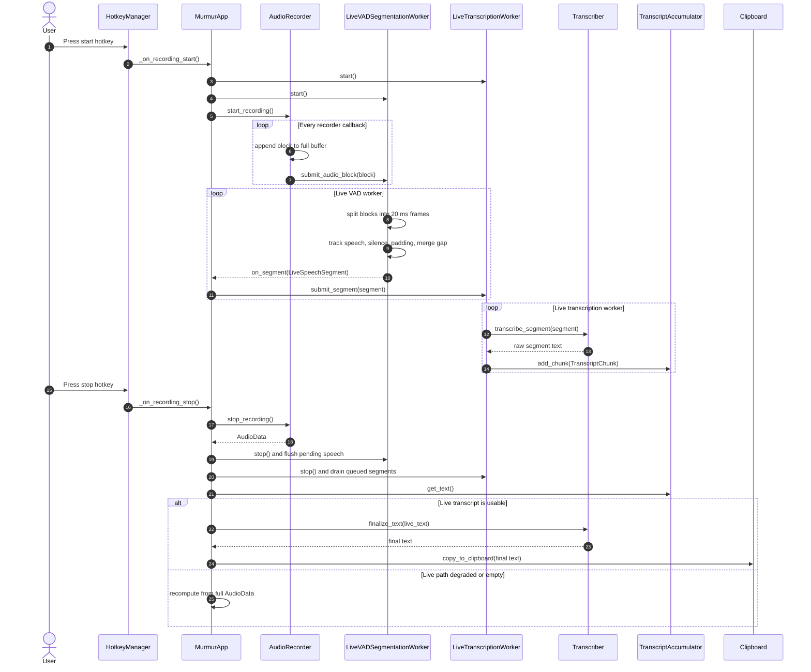
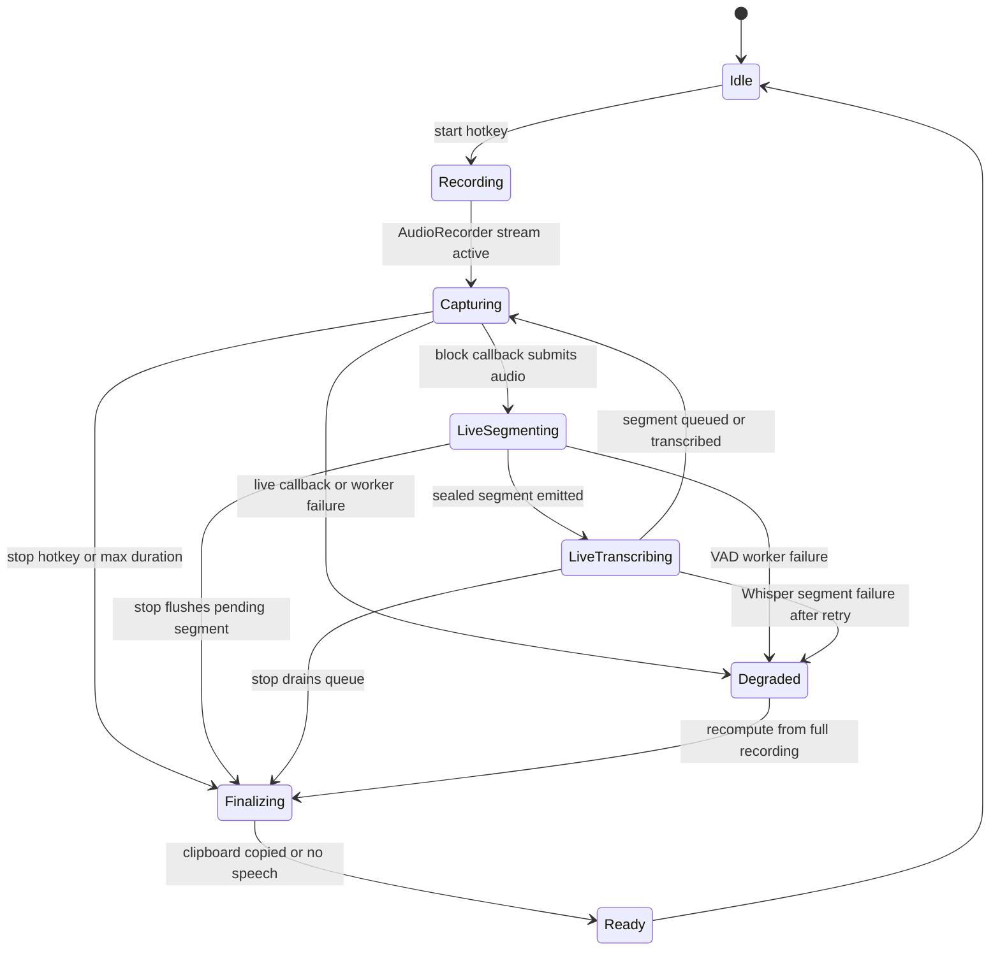

# Live Pipeline

The live pipeline is the low-latency path. It begins before the first audio
sample is captured and continues until the stop hotkey drains the pending work.

The important design choice is that live VAD and live Whisper work are
background workers. The audio callback stays lightweight: it appends to the full
recording buffer and submits a block to the live worker. Expensive work happens
off the callback thread.

## Live Worker Responsibilities

### Recorder Callback

The recorder callback is intentionally narrow:

- Append the current block to the full recording buffer.
- Enforce the configured maximum recording duration.
- Forward the block to live VAD if a callback is registered.
- Disable the live callback after the first callback failure.

This keeps capture resilient. Even if the live callback fails, the full buffer
still exists for stop-time fallback.

### Live VAD Worker

The live VAD worker owns:

- Block queueing.
- Carrying partial frames between recorder blocks.
- Converting frame audio to 16-bit PCM for WebRTC VAD.
- Start padding through a pre-speech frame buffer.
- Silence counting to decide when speech is sealed.
- End padding and min segment duration filtering.
- Merge-gap handling before emitting a segment.

### Live Transcription Worker

The live transcription worker owns:

- A serial queue of sealed speech segments.
- Segment-level retry.
- Per-segment transcription latency.
- Callback-safe failure reporting.
- Ordered transcript accumulation.

Serial transcription matters because it avoids multiple Whisper calls competing
for the same local model and keeps output ordering predictable.

## State Summary

## What To Watch When Changing This Path

- Keep the audio callback cheap. Do not run Whisper, LLM cleanup, file writes,
  or blocking UI work from the callback.
- Preserve the full recording buffer even when live workers fail.
- Keep live transcription serial unless the Whisper/model ownership changes.
- Keep callback logs content-safe. Current logs print IDs, durations, and text
  lengths rather than dictated text.
- If changing segment IDs or accumulation, verify that final text still follows
  the spoken order.
