# Pipeline Overview

Murmur has one user-visible workflow: press the hotkey, speak, press the hotkey
again, and paste the final transcript. Internally, that workflow is split into a
live path and a fallback path.

The live path starts VAD segmentation and Whisper transcription while recording
is still active. This lowers stop-time latency because many sealed speech
segments have already been transcribed before the user releases the hotkey.

The fallback path keeps the system reliable. Murmur still records the full audio
clip, so if live VAD or live transcription degrades, finalization can recompute
the transcript from the full recording.

```mermaid
flowchart LR
    HotkeyStart["Start hotkey"] --> AppStart["MurmurApp._on_recording_start"]
    AppStart --> MediaPause["Optional media pause"]
    AppStart --> LiveWorker["Start live transcription worker"]
    AppStart --> LiveVad["Start live VAD worker"]
    AppStart --> Recorder["AudioRecorder starts capture"]

    Recorder --> Blocks["100 ms float32 audio blocks"]
    Blocks --> FullBuffer["Full recording buffer"]
    Blocks --> LiveVad

    LiveVad --> Frames["20 ms VAD frames"]
    Frames --> SpeechSegments["Sealed live speech segments"]
    SpeechSegments --> LiveWhisper["Serial live Whisper transcription"]
    LiveWhisper --> Accumulator["TranscriptAccumulator"]

    HotkeyStop["Stop hotkey"] --> AppStop["MurmurApp._on_recording_stop"]
    AppStop --> StopRecorder["Stop recorder and return AudioData"]
    StopRecorder --> StopLive["Stop and drain live workers"]
    StopLive --> Finalize{"Usable live transcript?"}

    Accumulator --> Finalize
    Finalize -->|yes| FinalCleanup["Final document cleanup"]
    Finalize -->|no or degraded| Offline["Fallback from full AudioData"]
    FullBuffer --> Offline
    Offline --> OfflineVad["Offline VAD segmentation"]
    OfflineVad --> OfflineWhisper["Whisper segment transcription"]
    OfflineWhisper --> FinalCleanup

    FinalCleanup --> Ollama{"Ollama enabled?"}
    Ollama -->|yes| LLM["LLM cleanup and acceptance gate"]
    Ollama -->|no| Clipboard["Copy final text to clipboard"]
    LLM --> Clipboard
    Clipboard --> Notify["Notify user and optionally log metrics"]
```



## Main Concepts

### Capture

`AudioRecorder` opens a `sounddevice.InputStream` at the configured sample rate,
mono channel, and `float32` sample format. The stream callback stores each block
in the full recording buffer and forwards a copy to the live VAD worker when the
live callback is active.

The current recorder block size is 100 ms:

```python
blocksize=int(self.sample_rate * 0.1)
```

That block size is large enough to keep capture overhead low, while the VAD
worker later reframes the audio into smaller WebRTC-compatible frames.

### Live Segmentation

`LiveVADSegmentationWorker` receives recorder blocks through a queue. It splits
them into fixed-duration frames, runs WebRTC VAD, tracks speech and silence, and
emits complete `LiveSpeechSegment` objects only when speech has been sealed by
enough trailing silence.

### Live Transcription

`LiveTranscriptionWorker` receives sealed speech segments and transcribes them
serially. It does not apply document-level cleanup per segment. Instead, it
stores ordered `TranscriptChunk` objects in `TranscriptAccumulator`, preserving
segment order by `segment_id`.

### Finalization

When recording stops, Murmur stops capture, flushes pending VAD state, drains
queued live transcription work, and checks whether a usable live transcript
exists. If it does, Murmur performs final document cleanup and copies the text to
the clipboard.

If the live path degraded or produced no text, Murmur falls back to the full
recorded clip. The fallback path runs offline VAD segmentation and then Whisper
transcription over the resulting speech segments. If offline VAD is unavailable
or finds no speech, Murmur transcribes the full clip directly.

## Implementation Map

| Stage | Primary code | Notes |
| --- | --- | --- |
| Hotkey orchestration | [`src/main.py`](../src/main.py) | Starts and stops capture, workers, finalization, and fallback. |
| Audio capture | [`src/audio.py`](../src/audio.py) | Owns stream callback, full audio buffer, max duration stop. |
| Live VAD | [`src/vad_live.py`](../src/vad_live.py) | Converts blocks into frames and emits sealed speech segments. |
| Offline VAD | [`src/vad_segmenter.py`](../src/vad_segmenter.py) | Segments full clips during fallback or non-live processing. |
| Live transcription | [`src/transcription_live.py`](../src/transcription_live.py) | Serial queue, retry, ordered accumulation, metrics. |
| Whisper transcription | [`src/transcription.py`](../src/transcription.py) | Loads Whisper, normalizes audio, transcribes segments. |
| LLM cleanup | [`src/llm_postprocess.py`](../src/llm_postprocess.py) | Optional Ollama pass with conservative acceptance checks. |
