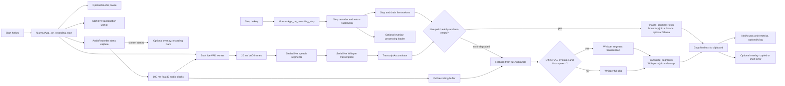

# Pipeline Overview

murmur has one user-visible workflow: press the hotkey, speak, press the hotkey
again, and paste the final transcript. Internally, that workflow is split into a
live path and a fallback path.

The live path starts VAD segmentation and Whisper transcription while recording
is still active. This lowers stop-time latency because many sealed speech
segments have already been transcribed before the user releases the hotkey.

The fallback path keeps the system reliable. murmur still records the full audio
clip, so if live VAD or live transcription degrades—or produces no usable text—
finalization can recompute the transcript from the full recording.


```mermaid
flowchart LR
    HotkeyStart["Start hotkey"] --> AppStart["MurmurApp._on_recording_start"]
    AppStart --> MediaPause["Optional media pause"]
    AppStart --> LiveWorker["Start live transcription worker"]
    AppStart --> LiveVad["Start live VAD worker"]
    AppStart --> Recorder["AudioRecorder starts capture"]
    Recorder -->|stream started| OverlayRecording["Optional overlay: recording bars"]

    Recorder --> Blocks["100 ms float32 audio blocks"]
    Blocks --> FullBuffer["Full recording buffer"]
    Blocks --> LiveVad

    LiveVad --> Frames["20 ms VAD frames"]
    Frames --> SpeechSegments["Sealed live speech segments"]
    SpeechSegments --> LiveWhisper["Serial live Whisper transcription"]
    LiveWhisper --> Accumulator["TranscriptAccumulator"]

    HotkeyStop["Stop hotkey"] --> AppStop["MurmurApp._on_recording_stop"]
    AppStop --> StopRecorder["Stop recorder and return AudioData"]
    StopRecorder --> OverlayProcessing["Optional overlay: processing loader"]
    StopRecorder --> StopLive["Stop and drain live workers"]
    StopLive --> LiveDecision{"Live path healthy and non-empty?"}
    Accumulator --> LiveDecision
    LiveDecision -->|yes| LiveCleanup["finalize_segment_texts<br/>boundary join + local + optional Ollama"]
    LiveDecision -->|no or degraded| Offline["Fallback from full AudioData"]
    FullBuffer --> Offline
    Offline --> OfflineVad{"Offline VAD available and finds speech?"}
    OfflineVad -->|yes| OfflineWhisper["Whisper segment transcription"]
    OfflineVad -->|no| FullClip["Whisper full clip"]
    OfflineWhisper --> OfflineCleanup["transcribe_segments<br/>Whisper + join + cleanup"]
    FullClip --> OfflineCleanup

    LiveCleanup --> Clipboard["Copy final text to clipboard"]
    OfflineCleanup --> Clipboard
    Clipboard --> Notify["Notify user, print metrics, optionally log"]
    Clipboard --> OverlayResult["Optional overlay: copied or short error"]
```

## Main Concepts

### Capture

`AudioRecorder` opens a `sounddevice.InputStream` at the configured sample rate,
mono channel, and `float32` sample format. The stream callback stores each block
in the full recording buffer and forwards a copy to the live VAD worker when the
live callback is active.

The current recorder block size is 100 ms:

```python
blocksize = int(self.sample_rate * 0.1)
```

That block size is large enough to keep capture overhead low, while the VAD
worker later reframes the audio into smaller WebRTC-compatible frames.

### Live Segmentation

`LiveVADSegmentationWorker` receives recorder blocks through a queue. It splits
them into fixed-duration frames, runs WebRTC VAD, tracks speech and silence, and
emits complete `LiveSpeechSegment` objects only when speech has been sealed by
enough trailing silence.

### Live Transcription

`LiveTranscriptionWorker` receives sealed speech segments and transcribes them
serially. It does not apply document-level cleanup per segment. Instead, it
stores ordered `TranscriptChunk` objects in `TranscriptAccumulator`, preserving
segment order by `segment_id`.

### Finalization

When recording stops, murmur stops capture, flushes pending VAD state, drains
queued live transcription work, and first checks the per-recording degraded flag.
If the live path is healthy and its accumulator contains text,
`finalize_segment_texts()` joins the ordered chunks and performs the final
cleanup pass.

If the live path degraded or produced no text, murmur falls back to the full
recorded clip. The fallback path runs offline VAD segmentation and then Whisper
transcription over the resulting speech segments. If offline VAD is unavailable
or finds no speech, murmur transcribes the full clip directly. Both the segmented
fallback and full-clip path perform final cleanup through
`transcribe_segments()`; a completed recording receives one final cleanup path,
not one cleanup call per live chunk.

The recorder's full buffer is held in memory until finalization. It is not saved
to disk unless opt-in training-data logging is enabled and non-empty final text
is produced.

### Recording overlay

When **Show recording overlay** is on, a small dark pill above the primary
display's taskbar mirrors the session. It is status feedback only: it never
shows transcript text, reads no audio levels, takes no focus, and passes clicks
through to the app underneath.

| Session moment | Overlay |
| --- | --- |
| Input stream started successfully | Three gently pulsing bars |
| Capture stopped by hotkey or maximum duration | Icon-only loading spinner |
| Final text copied to the clipboard | Checkmark and `Copied to clipboard`, hidden after about 2 seconds |
| Start failure, no audio, no speech, transcription failure, or clipboard failure | Warning symbol and a fixed short message, hidden after about 4 seconds |

The recording bars appear only after `AudioRecorder` has started the input
stream; a failed start shows the error instead. Requests carry a session number
so a late event from an earlier session cannot hide or replace a newer one.

The overlay is drawn on the same persistent CustomTkinter UI thread as the
settings window, and `MurmurApp` only queues requests to it. Any overlay failure
is contained there and logged once without content, so capture, fallback,
cleanup, and clipboard output continue unchanged. Optional media pause/resume
warnings stay in the tray status and console rather than the overlay.

## Implementation Map

| Stage | Primary code | Notes |
| --- | --- | --- |
| Hotkey orchestration | [`src/main.py`](https://github.com/laceyp99/murmur/blob/main/src/main.py) | Starts and stops capture, workers, finalization, and fallback. |
| Audio capture | [`src/audio.py`](https://github.com/laceyp99/murmur/blob/main/src/audio.py) | Owns stream callback, full audio buffer, max duration stop. |
| Live VAD | [`src/vad_live.py`](https://github.com/laceyp99/murmur/blob/main/src/vad_live.py) | Converts blocks into frames and emits sealed speech segments. |
| Offline VAD | [`src/vad_segmenter.py`](https://github.com/laceyp99/murmur/blob/main/src/vad_segmenter.py) | Segments full clips during fallback or non-live processing. |
| Live transcription | [`src/transcription_live.py`](https://github.com/laceyp99/murmur/blob/main/src/transcription_live.py) | Serial queue, retry, ordered accumulation, metrics. |
| Whisper transcription | [`src/transcription.py`](https://github.com/laceyp99/murmur/blob/main/src/transcription.py) | Loads Whisper, normalizes audio, transcribes segments. |
| LLM cleanup | [`src/llm_postprocess.py`](https://github.com/laceyp99/murmur/blob/main/src/llm_postprocess.py) | Optional Ollama pass with conservative acceptance checks. |
| Delivery and persistence | [`src/main.py`](https://github.com/laceyp99/murmur/blob/main/src/main.py) | Copies text, reports the result, and invokes opt-in logging. |
| Recording overlay | [`src/recording_overlay.py`](https://github.com/laceyp99/murmur/blob/main/src/recording_overlay.py) | Passive status pill; state requests are queued through `src/settings_gui.py`. |
