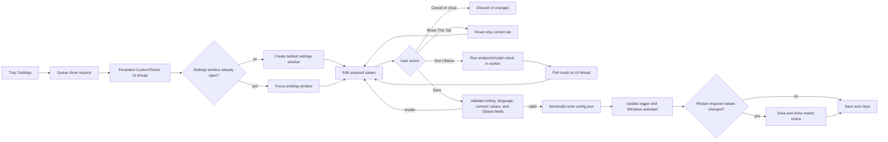
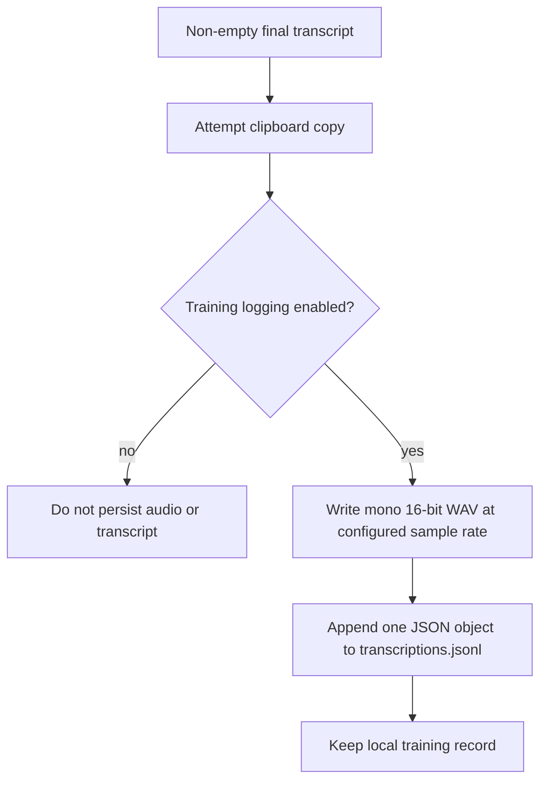

# Settings And Privacy

Murmur exposes user-facing settings through the **Settings** item in the
system-tray menu. The window is owned by a persistent CustomTkinter UI thread;
the tray callback places a request on that thread instead of creating a second
independent UI loop.

## Settings workflow



## Settings tabs

| Tab | Controls | Runtime effect |
| --- | --- | --- |
| General | Hotkey, notifications, Windows startup, media pause | Hotkey registration and cached recorder/transcriber state are refreshed on restart; notifications, media pause, and startup settings are handled by the save path. |
| VAD | Aggressiveness, speech padding, silence-to-stop duration | Applied to the VAD workers created for recordings; the UI requests a restart after changes. |
| Transcription | Whisper model, device, language, maximum recording duration | Used by startup-created recorder/transcriber components; restart after changes. |
| LLM Cleanup | Enablement, endpoint, model, timeout, preload, connection test | The final pass is optional; endpoint/model/preload changes require restart according to the UI notice. |
| Data Privacy | Training-data logging and delete action | Logging enablement applies to subsequent finalizations; deletion is immediate after confirmation. |

Numeric controls have both a slider and an editable number field. Values are
clamped to the configured bounds when displayed or saved. Non-numeric or
non-finite input blocks Save, restores that field's persisted value in the UI,
and leaves `config.json` unchanged. Reset controls change only the current UI
state until Save is pressed.

The sample rate is not exposed in the settings window. It defaults to 16,000 Hz
and can be changed only by editing `config.json`; restart after doing so.

## Persistent configuration

The configuration file is `%APPDATA%\murmur\config.json`. Murmur creates the
directory and file on first launch. Missing keys receive values from
`DEFAULT_CONFIG`. If the file is malformed, invalid UTF-8, or not a JSON object,
Murmur moves it to a timestamped `config.corrupt-*.json` backup, writes defaults,
and shows a startup notice.

The current default values are:

```json
{
  "hotkey": "ctrl+shift+space",
  "model": "small",
  "device": "cuda",
  "language": null,
  "sample_rate": 16000,
  "vad_aggressiveness": 1,
  "vad_padding_ms": 220,
  "vad_silence_duration_ms": 400,
  "max_recording_duration": 300,
  "enable_logging": false,
  "enable_notifications": true,
  "start_with_windows": true,
  "pause_media_while_recording": true,
  "logging_consent_updated_at": null,
  "logging_consent_source": null,
  "ollama_enabled": true,
  "ollama_endpoint": "http://localhost:11434",
  "ollama_model_name": "granite4.1:3b",
  "ollama_timeout_seconds": 60,
  "ollama_preload_model": true
}
```

The settings save operation writes a temporary file and replaces the config
atomically. Windows autostart is stored in the current user's
`Software\Microsoft\Windows\CurrentVersion\Run` key and launches the same
environment's `pythonw.exe` with `run.py`.

## Training-data logging

Logging is disabled by default and enabling it requires confirmation in the
privacy tab. Murmur logs only when final text is non-empty and logging is
enabled. The logger runs after the clipboard attempt and writes:



Files are stored in `%APPDATA%\murmur\training_data\`:

```text
training_data/
├── audio/
│   └── YYYYMMDD_HHMMSS_microseconds.wav
└── transcriptions.jsonl
```

Each metadata record contains the timestamp, audio filename, final transcript,
recorded duration, configured model, finalization latency, and live-segment
metrics. `processing_time` measures from stop-time finalization start through
the clipboard attempt; it excludes the subsequent logging write. Live latency
values measure Whisper runtime for chunks that contributed text, not queue wait
or finalization time. If no live chunks contributed text, the count is `0` and
the latency fields are `null`.

The **Delete Logged Data** action displays a file count and approximate size,
asks for confirmation, then removes the logged WAV files and JSONL metadata.
Disabling logging stops future writes; it does not delete existing records.

## Vocabulary and network boundary

An optional gitignored `user_vocab.json` in the repository root supplies
preferred spellings to the Ollama prompt. It is loaded lazily only when the
Ollama post-processor is built; it does not change Whisper's recognition and is
ignored when Ollama cleanup is disabled.

Whisper audio inference and the default Ollama endpoint are local. If
`ollama_endpoint` points to another machine, the final transcript sent for
cleanup leaves the local computer. The Ollama cleanup result is accepted only
when it remains transcript-like; otherwise Murmur keeps the locally cleaned
text.

## Source map

- [`src/settings_gui.py`](https://github.com/laceyp99/murmur/blob/main/src/settings_gui.py): UI thread, validation, save,
  connection test, and deletion workflow.
- [`src/settings_schema.py`](https://github.com/laceyp99/murmur/blob/main/src/settings_schema.py): tabs, defaults,
  bounds, and restart metadata.
- [`src/config.py`](https://github.com/laceyp99/murmur/blob/main/src/config.py): config path, defaults, recovery, and
  atomic persistence.
- [`src/logger.py`](https://github.com/laceyp99/murmur/blob/main/src/logger.py): opt-in WAV/JSONL storage and purge.
- [`src/user_vocab.py`](https://github.com/laceyp99/murmur/blob/main/src/user_vocab.py): vocabulary file handling.
