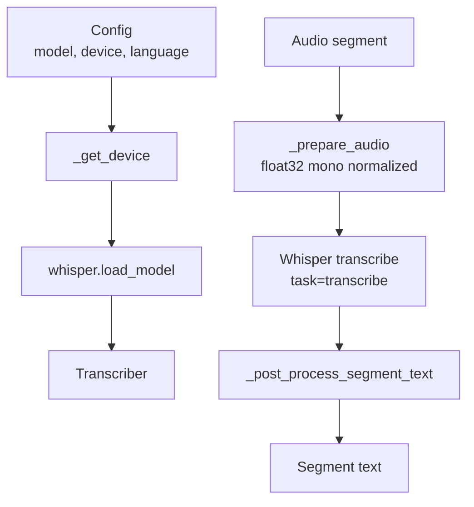
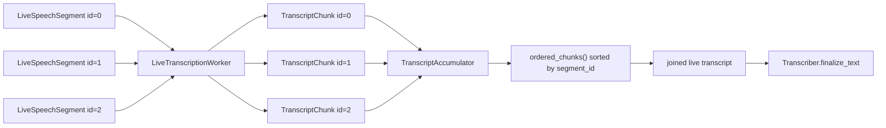
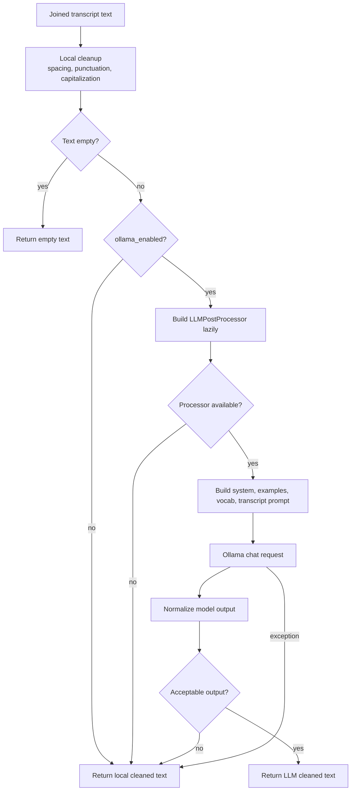

# Transcription And Cleanup

Murmur uses Whisper for speech-to-text and an optional local Ollama model for a
single final cleanup pass. Segment transcription and document cleanup are kept
separate so the live path can transcribe chunks early without asking the LLM to
rewrite partial text.

## Whisper Model Ownership

`Transcriber` owns Whisper model loading, device selection, audio normalization,
segment transcription, and final document cleanup.

The live worker calls `transcribe_segment()`, which returns segment text without
document-level cleanup. The offline path calls `transcribe_segments()`, which
transcribes each segment, joins the text, and then calls `finalize_text()`.

## Live Accumulation

`TranscriptAccumulator` stores chunks by `segment_id` and returns them in sorted
order. This makes the output stable even if callback timing changes.

## Final Cleanup

Final cleanup has two layers:

1. Local cleanup in `Transcriber._post_process_document()`.
2. Optional Ollama cleanup in `LLMPostProcessor.process()`.

## Ollama Acceptance Gate

The LLM output is accepted only if it still looks like transcript text. The gate
rejects output when it is:

- Empty.
- Prefixed with common assistant-style preambles.
- Much longer than the input.
- Markdown heading shaped.
- List shaped.
- Chat transcript shaped with labels such as `user:` or `assistant:`.

This is intentionally conservative. The LLM pass should improve punctuation,
capitalization, spacing, and obvious recognition mistakes, but it should not
turn dictated text into an answer, a list, or a rewritten document.

## Vocabulary Overrides

`user_vocab.json` is loaded lazily when the LLM post-processor is built. Entries
are included in the prompt as preferred vocabulary and corrections. This keeps
personal names and project-specific terms out of the codebase while still
allowing the local cleanup model to prefer them.

## Implementation Map

| Concern | Code |
| --- | --- |
| Whisper model loading | [`src/transcription.py`](../src/transcription.py) |
| Segment transcription | [`src/transcription.py`](../src/transcription.py) |
| Live transcription queue | [`src/transcription_live.py`](../src/transcription_live.py) |
| Transcript ordering and metrics | [`src/transcription_live.py`](../src/transcription_live.py) |
| Ollama client wrapper | [`src/llm_postprocess.py`](../src/llm_postprocess.py) |
| LLM prompt and acceptance gate | [`src/llm_postprocess.py`](../src/llm_postprocess.py) |
| User vocabulary loading | [`src/user_vocab.py`](../src/user_vocab.py) |
