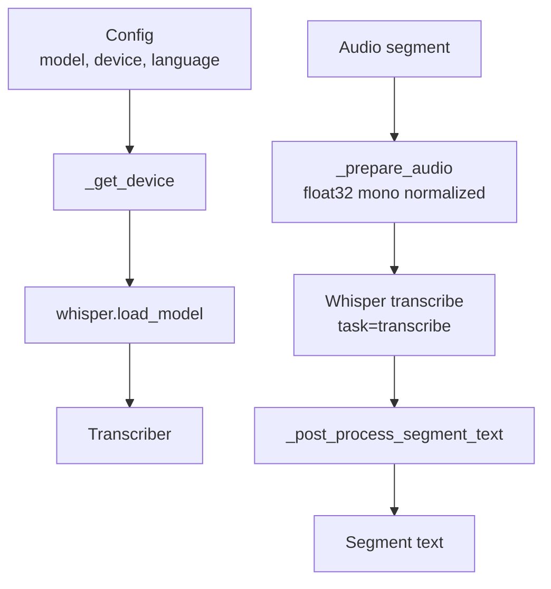
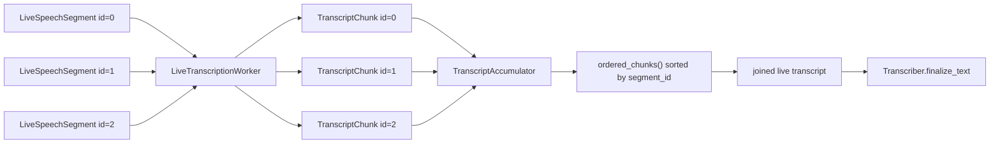
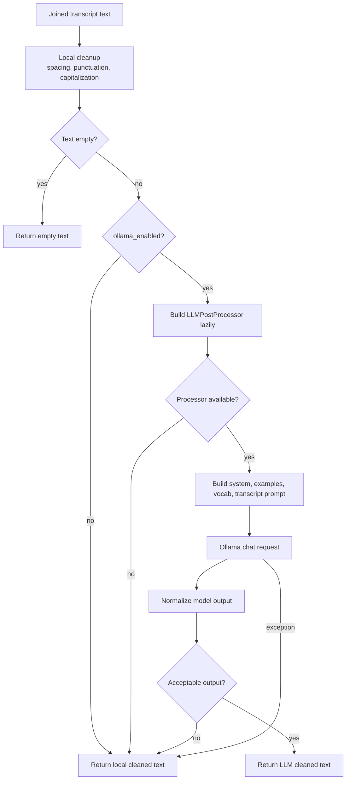

# Transcription And Cleanup

Murmur uses Whisper for speech-to-text and an optional Ollama model—local by
default—for a single final cleanup pass. Segment transcription and document
cleanup are kept separate so the live path can transcribe chunks early without
asking the LLM to rewrite partial text.

## Whisper Model Ownership

`Transcriber` owns Whisper model loading, device selection, audio normalization,
segment transcription, and final document cleanup.

```mermaid
flowchart TB
    Config["Config<br/>model, device, language"] --> Device["_get_device"]
    Device --> Model["whisper.load_model"]
    Model --> Transcriber["Transcriber"]

    Segment["Audio segment"] --> Prepare["_prepare_audio<br/>float32 mono normalized"]
    Prepare --> Whisper["Whisper transcribe<br/>task=transcribe"]
    Whisper --> SegmentCleanup["_post_process_segment_text"]
    SegmentCleanup --> SegmentText["Segment text"]
```

The live worker calls `transcribe_segment()`, which returns segment text without
document-level cleanup. The offline path calls `transcribe_segments()`, which
transcribes each segment, joins the text, and then calls `finalize_text()`.

The configured `device` selects CUDA only when it is requested and available;
otherwise `Transcriber` uses CPU. Whisper calls are made with `task="transcribe"`
and the configured language (or automatic detection when language is empty or
`null`). Before text is accepted, Whisper result segments with both metadata
fields are filtered when `no_speech_prob > 0.4` and `avg_logprob <= -0.6`.
Segments with missing filter metadata are retained.

## Live Accumulation

```mermaid
flowchart LR
    Segment0["LiveSpeechSegment id=0"] --> Worker["LiveTranscriptionWorker"]
    Segment1["LiveSpeechSegment id=1"] --> Worker
    Segment2["LiveSpeechSegment id=2"] --> Worker

    Worker --> Chunk0["TranscriptChunk id=0"]
    Worker --> Chunk1["TranscriptChunk id=1"]
    Worker --> Chunk2["TranscriptChunk id=2"]

    Chunk0 --> Accumulator["TranscriptAccumulator"]
    Chunk1 --> Accumulator
    Chunk2 --> Accumulator
    Accumulator --> Ordered["ordered_chunks() sorted by segment_id"]
    Ordered --> LiveText["joined live transcript"]
    LiveText --> Finalize["Transcriber.finalize_text"]
```

`TranscriptAccumulator` stores chunks by `segment_id` and returns them in sorted
order. This makes the output stable even if callback timing changes.

At stop time, the app calls `finalize_segment_texts()` once on the ordered live
chunk texts. That joins chunks while neutralizing punctuation and capitalization
artifacts at artificial VAD boundaries, then applies document cleanup.

## Final Cleanup

Final cleanup has two layers:

1. Local cleanup in `Transcriber._post_process_document()`.
2. Optional Ollama cleanup in `LLMPostProcessor.process()`.

The Ollama processor is constructed lazily on the first finalization that needs
it. Startup warmup only checks for the configured installed model and attempts
to load it into memory; it does not download a missing model. If the client
cannot be built, the request fails, or the response fails the acceptance gate,
the local cleanup result is returned.

```mermaid
flowchart TB
    RawText["Joined transcript text"] --> LocalCleanup["Local cleanup<br/>spacing, punctuation, capitalization"]
    LocalCleanup --> Empty{"Text empty?"}
    Empty -->|yes| ReturnEmpty["Return empty text"]
    Empty -->|no| Enabled{"ollama_enabled?"}
    Enabled -->|no| ReturnLocal["Return local cleaned text"]
    Enabled -->|yes| BuildProcessor["Build LLMPostProcessor lazily"]
    BuildProcessor --> Available{"Processor available?"}
    Available -->|no| ReturnLocal
    Available -->|yes| BuildMessages["Build system, examples, vocab, transcript prompt"]
    BuildMessages --> Ollama["Ollama chat request"]
    Ollama --> Normalize["Normalize model output"]
    Normalize --> Gate{"Acceptable output?"}
    Gate -->|yes| ReturnLLM["Return LLM cleaned text"]
    Gate -->|no| ReturnLocal
    Ollama -->|exception| ReturnLocal
```

## Ollama Acceptance Gate

The LLM output is accepted only if it still looks like transcript text. The gate
rejects output when it is:

- Empty.
- Prefixed with common assistant-style preambles.
- Much longer than the input.
- Markdown heading shaped.
- List shaped.
- Chat transcript shaped with labels such as `user:` or `assistant:`.

This is intentionally conservative. The LLM pass should improve punctuation,
capitalization, spacing, and obvious recognition mistakes, but it should not
turn dictated text into an answer, a list, or a rewritten document.

## Vocabulary Overrides

`user_vocab.json` is loaded lazily when the LLM post-processor is built. Entries
are included in the prompt as preferred vocabulary and corrections. This keeps
personal names and project-specific terms out of the codebase while still
allowing the local cleanup model to prefer them. Source launches read the file
from the repository root; packaged launches read it from
`%APPDATA%\murmur\user_vocab.json`.

## Implementation Map

| Concern | Code |
| --- | --- |
| Whisper model loading | [`src/transcription.py`](https://github.com/laceyp99/murmur/blob/main/src/transcription.py) |
| Segment transcription | [`src/transcription.py`](https://github.com/laceyp99/murmur/blob/main/src/transcription.py) |
| Live transcription queue | [`src/transcription_live.py`](https://github.com/laceyp99/murmur/blob/main/src/transcription_live.py) |
| Transcript ordering and metrics | [`src/transcription_live.py`](https://github.com/laceyp99/murmur/blob/main/src/transcription_live.py) |
| Ollama client wrapper | [`src/llm_postprocess.py`](https://github.com/laceyp99/murmur/blob/main/src/llm_postprocess.py) |
| LLM prompt and acceptance gate | [`src/llm_postprocess.py`](https://github.com/laceyp99/murmur/blob/main/src/llm_postprocess.py) |
| User vocabulary loading | [`src/user_vocab.py`](https://github.com/laceyp99/murmur/blob/main/src/user_vocab.py) |
