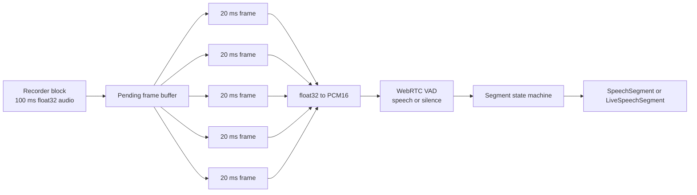
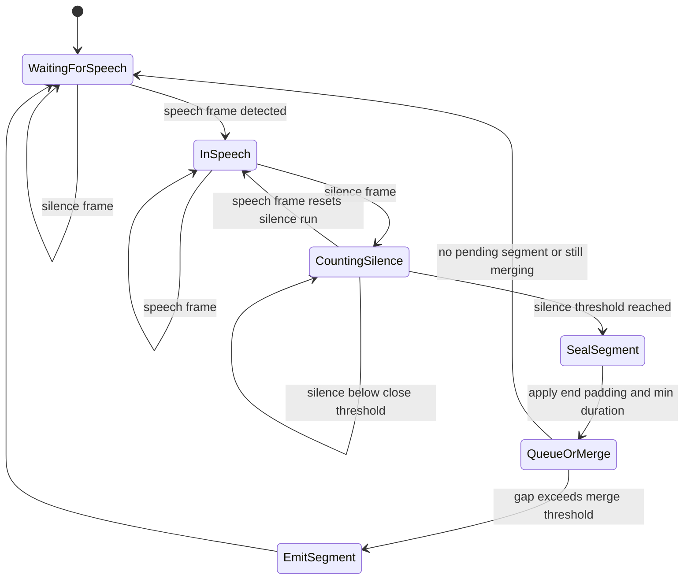
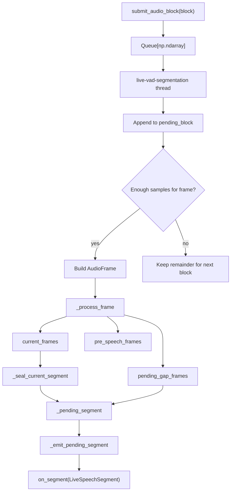
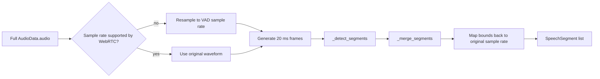

# VAD Segmentation

Murmur uses WebRTC VAD to convert continuous audio into speech segments. The
same timing settings drive both live segmentation and offline segmentation, but
the two paths differ in how they receive audio:

- Live VAD consumes queued recorder blocks while capture is active.
- Offline VAD receives the full recorded clip during fallback or non-live
  processing.

## Timing Model

The VAD timing model starts with `VADSettings`. In normal app runtime,
`VADSettings.from_app_config()` overrides the user-facing values from config.

| Setting | Class default | App runtime default | Purpose |
| --- | ---: | ---: | --- |
| `frame_duration_ms` | 20 | 20 | Fixed frame size passed to WebRTC VAD. |
| `aggressiveness` | 1 | `vad_aggressiveness` = 1 | WebRTC speech detection strictness. |
| `start_padding_ms` | 132 | derived from `vad_padding_ms` | Audio kept before detected speech starts. |
| `end_padding_ms` | 220 | `vad_padding_ms` = 220 | Audio kept after detected speech ends. |
| `silence_duration_ms` | 320 | `vad_silence_duration_ms` = 400 | Silence needed before closing a segment. |
| `min_segment_duration_ms` | 220 | 220 | Shorter segments are discarded. |
| `merge_gap_ms` | 120 | 120 | Small gaps between padded segments are merged. |

`start_padding_ms` is derived from the user-facing `vad_padding_ms` setting in
the app config. The configured value becomes end padding, and start padding is
roughly 60 percent of that value.

## Segment State Machine

## Live VAD Details

The live worker keeps enough state to handle recorder blocks that do not align
perfectly with VAD frames:

The live worker emits a segment only after it is sealed. This prevents Whisper
from transcribing unstable partial speech and keeps the final transcript closer
to complete phrases.

## Offline VAD Details

Offline VAD receives a full waveform and returns ordered `SpeechSegment`
objects:

Offline VAD can resample unsupported source rates for analysis and then map
segment bounds back to the original waveform. Live VAD currently requires a
WebRTC-supported sample rate because it processes frames continuously as audio
arrives.

## Practical Reading

When inspecting a VAD behavior change, read in this order:

1. [`src/vad_config.py`](../src/vad_config.py) for timing values.
2. [`src/vad_audio.py`](../src/vad_audio.py) for frame generation and PCM
   conversion.
3. [`src/vad_live.py`](../src/vad_live.py) for live worker state.
4. [`src/vad_segmenter.py`](../src/vad_segmenter.py) for offline segmentation.
5. [`tests/test_vad.py`](../tests/test_vad.py) for expected edge cases.
